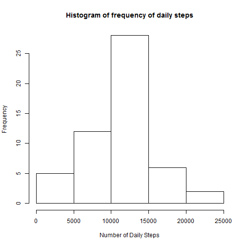
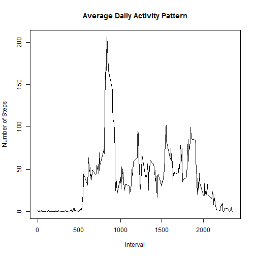
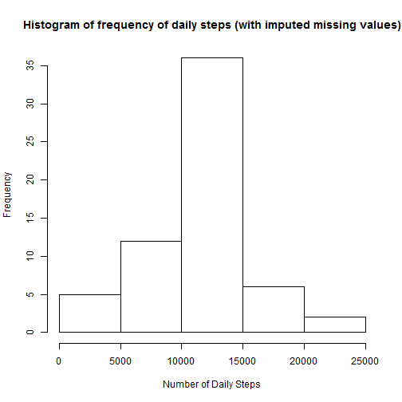
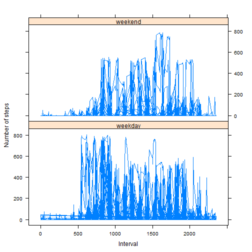

# Reproducible Research: Peer Assessment 1
Miscellaneous setup
``` { r misc}
install.packages("xtable")
```

## Loading and preprocessing the data
The raw data is assumed to be int he working directory (this is a reasonable
assumption since the project istarted as a clone which contains the data).

Unzip and read the datafile.

```r
fileName = 'activity'
if( !file.exists(paste0( fileName, '.csv'))) {
  unzip( paste0( fileName, '.zip'))
}
data = read.csv(paste0( fileName, '.csv'))
```
## Manipulate the Data
Remove NA data and change date strings to dat objects.

```r
data <-  na.omit(data) 
data$date <- as.Date(data$date, "%Y-%m-%d")
```
## What is mean total number of steps taken per day?

```r
daily = tapply( data$steps, data$date, sum)
hist( daily, main = "Histogram of frequency of daily steps", xlab = "Number of Daily Steps")
```

 

Compute daily mean and median values.

```r
library(xtable)
```

```
## Warning: package 'xtable' was built under R version 3.1.1
```

```r
dmean=tapply( data$steps, data$date, mean)
dmedian=tapply( data$steps, data$date, median)
dboth = cbind( dmean, dmedian)
colnames( dboth) <- c( "Mean", "Median" ) 
```
### Table of Daily Mean and Median Step Values

```r
print( xtable(dboth), type="html")
```

<!-- html table generated in R 3.1.0 by xtable 1.7-3 package -->
<!-- Sat Aug 16 13:43:10 2014 -->
<TABLE border=1>
<TR> <TH>  </TH> <TH> Mean </TH> <TH> Median </TH>  </TR>
  <TR> <TD align="right"> 2012-10-02 </TD> <TD align="right"> 0.44 </TD> <TD align="right"> 0.00 </TD> </TR>
  <TR> <TD align="right"> 2012-10-03 </TD> <TD align="right"> 39.42 </TD> <TD align="right"> 0.00 </TD> </TR>
  <TR> <TD align="right"> 2012-10-04 </TD> <TD align="right"> 42.07 </TD> <TD align="right"> 0.00 </TD> </TR>
  <TR> <TD align="right"> 2012-10-05 </TD> <TD align="right"> 46.16 </TD> <TD align="right"> 0.00 </TD> </TR>
  <TR> <TD align="right"> 2012-10-06 </TD> <TD align="right"> 53.54 </TD> <TD align="right"> 0.00 </TD> </TR>
  <TR> <TD align="right"> 2012-10-07 </TD> <TD align="right"> 38.25 </TD> <TD align="right"> 0.00 </TD> </TR>
  <TR> <TD align="right"> 2012-10-09 </TD> <TD align="right"> 44.48 </TD> <TD align="right"> 0.00 </TD> </TR>
  <TR> <TD align="right"> 2012-10-10 </TD> <TD align="right"> 34.38 </TD> <TD align="right"> 0.00 </TD> </TR>
  <TR> <TD align="right"> 2012-10-11 </TD> <TD align="right"> 35.78 </TD> <TD align="right"> 0.00 </TD> </TR>
  <TR> <TD align="right"> 2012-10-12 </TD> <TD align="right"> 60.35 </TD> <TD align="right"> 0.00 </TD> </TR>
  <TR> <TD align="right"> 2012-10-13 </TD> <TD align="right"> 43.15 </TD> <TD align="right"> 0.00 </TD> </TR>
  <TR> <TD align="right"> 2012-10-14 </TD> <TD align="right"> 52.42 </TD> <TD align="right"> 0.00 </TD> </TR>
  <TR> <TD align="right"> 2012-10-15 </TD> <TD align="right"> 35.20 </TD> <TD align="right"> 0.00 </TD> </TR>
  <TR> <TD align="right"> 2012-10-16 </TD> <TD align="right"> 52.38 </TD> <TD align="right"> 0.00 </TD> </TR>
  <TR> <TD align="right"> 2012-10-17 </TD> <TD align="right"> 46.71 </TD> <TD align="right"> 0.00 </TD> </TR>
  <TR> <TD align="right"> 2012-10-18 </TD> <TD align="right"> 34.92 </TD> <TD align="right"> 0.00 </TD> </TR>
  <TR> <TD align="right"> 2012-10-19 </TD> <TD align="right"> 41.07 </TD> <TD align="right"> 0.00 </TD> </TR>
  <TR> <TD align="right"> 2012-10-20 </TD> <TD align="right"> 36.09 </TD> <TD align="right"> 0.00 </TD> </TR>
  <TR> <TD align="right"> 2012-10-21 </TD> <TD align="right"> 30.63 </TD> <TD align="right"> 0.00 </TD> </TR>
  <TR> <TD align="right"> 2012-10-22 </TD> <TD align="right"> 46.74 </TD> <TD align="right"> 0.00 </TD> </TR>
  <TR> <TD align="right"> 2012-10-23 </TD> <TD align="right"> 30.97 </TD> <TD align="right"> 0.00 </TD> </TR>
  <TR> <TD align="right"> 2012-10-24 </TD> <TD align="right"> 29.01 </TD> <TD align="right"> 0.00 </TD> </TR>
  <TR> <TD align="right"> 2012-10-25 </TD> <TD align="right"> 8.65 </TD> <TD align="right"> 0.00 </TD> </TR>
  <TR> <TD align="right"> 2012-10-26 </TD> <TD align="right"> 23.53 </TD> <TD align="right"> 0.00 </TD> </TR>
  <TR> <TD align="right"> 2012-10-27 </TD> <TD align="right"> 35.14 </TD> <TD align="right"> 0.00 </TD> </TR>
  <TR> <TD align="right"> 2012-10-28 </TD> <TD align="right"> 39.78 </TD> <TD align="right"> 0.00 </TD> </TR>
  <TR> <TD align="right"> 2012-10-29 </TD> <TD align="right"> 17.42 </TD> <TD align="right"> 0.00 </TD> </TR>
  <TR> <TD align="right"> 2012-10-30 </TD> <TD align="right"> 34.09 </TD> <TD align="right"> 0.00 </TD> </TR>
  <TR> <TD align="right"> 2012-10-31 </TD> <TD align="right"> 53.52 </TD> <TD align="right"> 0.00 </TD> </TR>
  <TR> <TD align="right"> 2012-11-02 </TD> <TD align="right"> 36.81 </TD> <TD align="right"> 0.00 </TD> </TR>
  <TR> <TD align="right"> 2012-11-03 </TD> <TD align="right"> 36.70 </TD> <TD align="right"> 0.00 </TD> </TR>
  <TR> <TD align="right"> 2012-11-05 </TD> <TD align="right"> 36.25 </TD> <TD align="right"> 0.00 </TD> </TR>
  <TR> <TD align="right"> 2012-11-06 </TD> <TD align="right"> 28.94 </TD> <TD align="right"> 0.00 </TD> </TR>
  <TR> <TD align="right"> 2012-11-07 </TD> <TD align="right"> 44.73 </TD> <TD align="right"> 0.00 </TD> </TR>
  <TR> <TD align="right"> 2012-11-08 </TD> <TD align="right"> 11.18 </TD> <TD align="right"> 0.00 </TD> </TR>
  <TR> <TD align="right"> 2012-11-11 </TD> <TD align="right"> 43.78 </TD> <TD align="right"> 0.00 </TD> </TR>
  <TR> <TD align="right"> 2012-11-12 </TD> <TD align="right"> 37.38 </TD> <TD align="right"> 0.00 </TD> </TR>
  <TR> <TD align="right"> 2012-11-13 </TD> <TD align="right"> 25.47 </TD> <TD align="right"> 0.00 </TD> </TR>
  <TR> <TD align="right"> 2012-11-15 </TD> <TD align="right"> 0.14 </TD> <TD align="right"> 0.00 </TD> </TR>
  <TR> <TD align="right"> 2012-11-16 </TD> <TD align="right"> 18.89 </TD> <TD align="right"> 0.00 </TD> </TR>
  <TR> <TD align="right"> 2012-11-17 </TD> <TD align="right"> 49.79 </TD> <TD align="right"> 0.00 </TD> </TR>
  <TR> <TD align="right"> 2012-11-18 </TD> <TD align="right"> 52.47 </TD> <TD align="right"> 0.00 </TD> </TR>
  <TR> <TD align="right"> 2012-11-19 </TD> <TD align="right"> 30.70 </TD> <TD align="right"> 0.00 </TD> </TR>
  <TR> <TD align="right"> 2012-11-20 </TD> <TD align="right"> 15.53 </TD> <TD align="right"> 0.00 </TD> </TR>
  <TR> <TD align="right"> 2012-11-21 </TD> <TD align="right"> 44.40 </TD> <TD align="right"> 0.00 </TD> </TR>
  <TR> <TD align="right"> 2012-11-22 </TD> <TD align="right"> 70.93 </TD> <TD align="right"> 0.00 </TD> </TR>
  <TR> <TD align="right"> 2012-11-23 </TD> <TD align="right"> 73.59 </TD> <TD align="right"> 0.00 </TD> </TR>
  <TR> <TD align="right"> 2012-11-24 </TD> <TD align="right"> 50.27 </TD> <TD align="right"> 0.00 </TD> </TR>
  <TR> <TD align="right"> 2012-11-25 </TD> <TD align="right"> 41.09 </TD> <TD align="right"> 0.00 </TD> </TR>
  <TR> <TD align="right"> 2012-11-26 </TD> <TD align="right"> 38.76 </TD> <TD align="right"> 0.00 </TD> </TR>
  <TR> <TD align="right"> 2012-11-27 </TD> <TD align="right"> 47.38 </TD> <TD align="right"> 0.00 </TD> </TR>
  <TR> <TD align="right"> 2012-11-28 </TD> <TD align="right"> 35.36 </TD> <TD align="right"> 0.00 </TD> </TR>
  <TR> <TD align="right"> 2012-11-29 </TD> <TD align="right"> 24.47 </TD> <TD align="right"> 0.00 </TD> </TR>
   </TABLE>

## What is the average daily activity pattern?

```r
imean = tapply( data$steps, data$interval, mean)
lmean = unlist(labels(imean))
plot( lmean,imean, type="l", xlab="Interval", ylab="Number of Steps", main="Average Daily Activity Pattern")
```

 

```r
maxSteps = max( data$steps)
maxInt = data$interval[ data$steps==max( data$steps)]
maxDate = data$date[ data$steps==max( data$steps)]
```
###Maximum Number of Steps
The maximum number of steps (806) was in interval 615 on 2012-11-27.

## Imputing missing values
Replace NA values in number of steps with the daily average.

```r
data2 = read.csv(paste0( fileName, '.csv'))
data2$steps[is.na(data2$steps)]=tapply( data$steps, data$date, mean)
```

```
## Warning: number of items to replace is not a multiple of replacement
## length
```

```r
daily2 = tapply( data2$steps, data2$date, sum)
hist( daily2, main = "Histogram of frequency of daily steps (with imputed missing values)", xlab = "Number of Daily Steps")
```

 

```r
library(xtable)
dmean2=tapply( data2$steps, data2$date, mean)
dmedian2=tapply( data2$steps, data2$date, median)
dboth2 = cbind( dmean2, dmedian2)
colnames( dboth2) <- c( "Mean", "Median" ) 
```
### Table of Daily Mean and Median Step Values with Imputed Missing Values

```r
print( xtable(dboth2), type="html")
```

<!-- html table generated in R 3.1.0 by xtable 1.7-3 package -->
<!-- Sat Aug 16 13:43:11 2014 -->
<TABLE border=1>
<TR> <TH>  </TH> <TH> Mean </TH> <TH> Median </TH>  </TR>
  <TR> <TD align="right"> 2012-10-01 </TD> <TD align="right"> 37.46 </TD> <TD align="right"> 37.38 </TD> </TR>
  <TR> <TD align="right"> 2012-10-02 </TD> <TD align="right"> 0.44 </TD> <TD align="right"> 0.00 </TD> </TR>
  <TR> <TD align="right"> 2012-10-03 </TD> <TD align="right"> 39.42 </TD> <TD align="right"> 0.00 </TD> </TR>
  <TR> <TD align="right"> 2012-10-04 </TD> <TD align="right"> 42.07 </TD> <TD align="right"> 0.00 </TD> </TR>
  <TR> <TD align="right"> 2012-10-05 </TD> <TD align="right"> 46.16 </TD> <TD align="right"> 0.00 </TD> </TR>
  <TR> <TD align="right"> 2012-10-06 </TD> <TD align="right"> 53.54 </TD> <TD align="right"> 0.00 </TD> </TR>
  <TR> <TD align="right"> 2012-10-07 </TD> <TD align="right"> 38.25 </TD> <TD align="right"> 0.00 </TD> </TR>
  <TR> <TD align="right"> 2012-10-08 </TD> <TD align="right"> 37.13 </TD> <TD align="right"> 37.09 </TD> </TR>
  <TR> <TD align="right"> 2012-10-09 </TD> <TD align="right"> 44.48 </TD> <TD align="right"> 0.00 </TD> </TR>
  <TR> <TD align="right"> 2012-10-10 </TD> <TD align="right"> 34.38 </TD> <TD align="right"> 0.00 </TD> </TR>
  <TR> <TD align="right"> 2012-10-11 </TD> <TD align="right"> 35.78 </TD> <TD align="right"> 0.00 </TD> </TR>
  <TR> <TD align="right"> 2012-10-12 </TD> <TD align="right"> 60.35 </TD> <TD align="right"> 0.00 </TD> </TR>
  <TR> <TD align="right"> 2012-10-13 </TD> <TD align="right"> 43.15 </TD> <TD align="right"> 0.00 </TD> </TR>
  <TR> <TD align="right"> 2012-10-14 </TD> <TD align="right"> 52.42 </TD> <TD align="right"> 0.00 </TD> </TR>
  <TR> <TD align="right"> 2012-10-15 </TD> <TD align="right"> 35.20 </TD> <TD align="right"> 0.00 </TD> </TR>
  <TR> <TD align="right"> 2012-10-16 </TD> <TD align="right"> 52.38 </TD> <TD align="right"> 0.00 </TD> </TR>
  <TR> <TD align="right"> 2012-10-17 </TD> <TD align="right"> 46.71 </TD> <TD align="right"> 0.00 </TD> </TR>
  <TR> <TD align="right"> 2012-10-18 </TD> <TD align="right"> 34.92 </TD> <TD align="right"> 0.00 </TD> </TR>
  <TR> <TD align="right"> 2012-10-19 </TD> <TD align="right"> 41.07 </TD> <TD align="right"> 0.00 </TD> </TR>
  <TR> <TD align="right"> 2012-10-20 </TD> <TD align="right"> 36.09 </TD> <TD align="right"> 0.00 </TD> </TR>
  <TR> <TD align="right"> 2012-10-21 </TD> <TD align="right"> 30.63 </TD> <TD align="right"> 0.00 </TD> </TR>
  <TR> <TD align="right"> 2012-10-22 </TD> <TD align="right"> 46.74 </TD> <TD align="right"> 0.00 </TD> </TR>
  <TR> <TD align="right"> 2012-10-23 </TD> <TD align="right"> 30.97 </TD> <TD align="right"> 0.00 </TD> </TR>
  <TR> <TD align="right"> 2012-10-24 </TD> <TD align="right"> 29.01 </TD> <TD align="right"> 0.00 </TD> </TR>
  <TR> <TD align="right"> 2012-10-25 </TD> <TD align="right"> 8.65 </TD> <TD align="right"> 0.00 </TD> </TR>
  <TR> <TD align="right"> 2012-10-26 </TD> <TD align="right"> 23.53 </TD> <TD align="right"> 0.00 </TD> </TR>
  <TR> <TD align="right"> 2012-10-27 </TD> <TD align="right"> 35.14 </TD> <TD align="right"> 0.00 </TD> </TR>
  <TR> <TD align="right"> 2012-10-28 </TD> <TD align="right"> 39.78 </TD> <TD align="right"> 0.00 </TD> </TR>
  <TR> <TD align="right"> 2012-10-29 </TD> <TD align="right"> 17.42 </TD> <TD align="right"> 0.00 </TD> </TR>
  <TR> <TD align="right"> 2012-10-30 </TD> <TD align="right"> 34.09 </TD> <TD align="right"> 0.00 </TD> </TR>
  <TR> <TD align="right"> 2012-10-31 </TD> <TD align="right"> 53.52 </TD> <TD align="right"> 0.00 </TD> </TR>
  <TR> <TD align="right"> 2012-11-01 </TD> <TD align="right"> 37.77 </TD> <TD align="right"> 38.25 </TD> </TR>
  <TR> <TD align="right"> 2012-11-02 </TD> <TD align="right"> 36.81 </TD> <TD align="right"> 0.00 </TD> </TR>
  <TR> <TD align="right"> 2012-11-03 </TD> <TD align="right"> 36.70 </TD> <TD align="right"> 0.00 </TD> </TR>
  <TR> <TD align="right"> 2012-11-04 </TD> <TD align="right"> 36.93 </TD> <TD align="right"> 36.81 </TD> </TR>
  <TR> <TD align="right"> 2012-11-05 </TD> <TD align="right"> 36.25 </TD> <TD align="right"> 0.00 </TD> </TR>
  <TR> <TD align="right"> 2012-11-06 </TD> <TD align="right"> 28.94 </TD> <TD align="right"> 0.00 </TD> </TR>
  <TR> <TD align="right"> 2012-11-07 </TD> <TD align="right"> 44.73 </TD> <TD align="right"> 0.00 </TD> </TR>
  <TR> <TD align="right"> 2012-11-08 </TD> <TD align="right"> 11.18 </TD> <TD align="right"> 0.00 </TD> </TR>
  <TR> <TD align="right"> 2012-11-09 </TD> <TD align="right"> 37.62 </TD> <TD align="right"> 38.25 </TD> </TR>
  <TR> <TD align="right"> 2012-11-10 </TD> <TD align="right"> 37.39 </TD> <TD align="right"> 37.09 </TD> </TR>
  <TR> <TD align="right"> 2012-11-11 </TD> <TD align="right"> 43.78 </TD> <TD align="right"> 0.00 </TD> </TR>
  <TR> <TD align="right"> 2012-11-12 </TD> <TD align="right"> 37.38 </TD> <TD align="right"> 0.00 </TD> </TR>
  <TR> <TD align="right"> 2012-11-13 </TD> <TD align="right"> 25.47 </TD> <TD align="right"> 0.00 </TD> </TR>
  <TR> <TD align="right"> 2012-11-14 </TD> <TD align="right"> 37.26 </TD> <TD align="right"> 37.38 </TD> </TR>
  <TR> <TD align="right"> 2012-11-15 </TD> <TD align="right"> 0.14 </TD> <TD align="right"> 0.00 </TD> </TR>
  <TR> <TD align="right"> 2012-11-16 </TD> <TD align="right"> 18.89 </TD> <TD align="right"> 0.00 </TD> </TR>
  <TR> <TD align="right"> 2012-11-17 </TD> <TD align="right"> 49.79 </TD> <TD align="right"> 0.00 </TD> </TR>
  <TR> <TD align="right"> 2012-11-18 </TD> <TD align="right"> 52.47 </TD> <TD align="right"> 0.00 </TD> </TR>
  <TR> <TD align="right"> 2012-11-19 </TD> <TD align="right"> 30.70 </TD> <TD align="right"> 0.00 </TD> </TR>
  <TR> <TD align="right"> 2012-11-20 </TD> <TD align="right"> 15.53 </TD> <TD align="right"> 0.00 </TD> </TR>
  <TR> <TD align="right"> 2012-11-21 </TD> <TD align="right"> 44.40 </TD> <TD align="right"> 0.00 </TD> </TR>
  <TR> <TD align="right"> 2012-11-22 </TD> <TD align="right"> 70.93 </TD> <TD align="right"> 0.00 </TD> </TR>
  <TR> <TD align="right"> 2012-11-23 </TD> <TD align="right"> 73.59 </TD> <TD align="right"> 0.00 </TD> </TR>
  <TR> <TD align="right"> 2012-11-24 </TD> <TD align="right"> 50.27 </TD> <TD align="right"> 0.00 </TD> </TR>
  <TR> <TD align="right"> 2012-11-25 </TD> <TD align="right"> 41.09 </TD> <TD align="right"> 0.00 </TD> </TR>
  <TR> <TD align="right"> 2012-11-26 </TD> <TD align="right"> 38.76 </TD> <TD align="right"> 0.00 </TD> </TR>
  <TR> <TD align="right"> 2012-11-27 </TD> <TD align="right"> 47.38 </TD> <TD align="right"> 0.00 </TD> </TR>
  <TR> <TD align="right"> 2012-11-28 </TD> <TD align="right"> 35.36 </TD> <TD align="right"> 0.00 </TD> </TR>
  <TR> <TD align="right"> 2012-11-29 </TD> <TD align="right"> 24.47 </TD> <TD align="right"> 0.00 </TD> </TR>
  <TR> <TD align="right"> 2012-11-30 </TD> <TD align="right"> 37.53 </TD> <TD align="right"> 37.38 </TD> </TR>
   </TABLE>
## Are there differences in activity patterns between weekdays and weekends?
Yes, the data shows a difference between weekday and weekend activity.  

```r
data$isWeekday <- factor(weekdays(data$date) %in% c('Saturday','Sunday'), labels=c("weekday", "weekend"))
```

```r
library(lattice)
weekdays <- subset(data,data$isWeekday == "weekday")
weekends <- subset(data,data$isWeekday == "weekend")
xyplot( data$steps~data$interval | data$isWeekday, ylab="Number of steps", xlab="Interval", type="l", scales=list( alternating=TRUE),layout=c(1,2))
```

 
